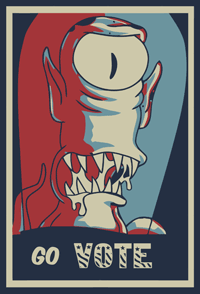

...is a Go library for conducting polls using various voting systems

##Install
Grab the package with: 

    $ go get github.com/Sam-Izdat/govote

[](https://drone.io/github.com/Sam-Izdat/govote/latest) 
[](http://opensource.org/licenses/MIT)
[](https://godoc.org/github.com/Sam-Izdat/govote)

##How do I even...
Behold.
```go
package main

import(
    "fmt"
    "github.com/Sam-Izdat/govote"
)

func main() {
    candidates := []string{"Memphis", "Nashville", "Knoxville", "Chattanooga"}
    schulze, _ := govote.Schulze.New(candidates)
    plurality, _ := govote.Plurality.New(candidates)
    runoff, _ := govote.InstantRunoff.New(candidates)

    ballotMemphis := []string{"Memphis", "Nashville", "Chattanooga", "Knoxville"}
    ballotNashville := []string{"Nashville", "Chattanooga", "Knoxville", "Memphis"}
    ballotChattanooga := []string{"Chattanooga", "Knoxville", "Nashville", "Memphis"}
    ballotKnoxville := []string{"Knoxville", "Chattanooga", "Nashville", "Memphis"}

    for i := 0; i < 42; i++ {
        schulze.AddBallot(ballotMemphis)
        plurality.AddBallot(ballotMemphis[0])
        runoff.AddBallot(ballotMemphis)
    }
    for i := 0; i < 26; i++ {
        schulze.AddBallot(ballotNashville)
        plurality.AddBallot(ballotNashville[0])
        runoff.AddBallot(ballotNashville)
    }
    for i := 0; i < 15; i++ {
        schulze.AddBallot(ballotChattanooga)
        plurality.AddBallot(ballotChattanooga[0])
        runoff.AddBallot(ballotChattanooga)
    }
    for i := 0; i < 17; i++ {
        schulze.AddBallot(ballotKnoxville)
        plurality.AddBallot(ballotKnoxville[0])
        runoff.AddBallot(ballotKnoxville)
    }

    // Schulze scores are a tally of superior strongest-path comparisons for the candidate
    fmt.Println(schulze.Evaluate())
    // => [Nashville] [{Nashville 3} {Chattanooga 2} {Knoxville 1} {Memphis 0}] <nil>

    // Plurality scores are the number of votes for the candidate
    fmt.Println(plurality.Evaluate())
    // => [Memphis] [{Memphis 42} {Nashville 26} {Knoxville 17} {Chattanooga 15}] <nil>

    // Instant-runoff polls return a slice of rounds in name-key score-value maps
    fmt.Println(runoff.Evaluate())
    // => [Knoxville] [map[Memphis:42 Nashville:26 Chattanooga:15 Knoxville:17] \
    // =>   map[Memphis:42 Nashville:26 Knoxville:32] \
    // =>   map[Knoxville:58 Memphis:42] \
    // =>   map[Knoxville:100]] \
    // =>   <nil>
}
```

Keep in mind that multiple winners are possible. 

Condorcet polls may result in a tie and, in the event of a voting paradox, will return all candidates as winners. 

Instant runoff polls, in the event of loser ties at the end of a round, will either eliminate the tied candidates if the sum of their scores is lower than the score of the leader or else elimate a loser at random. If, in the final round, two or more candidates are tied for victory they will all be returned as winners.

Plurality polls will return multiple winner in the event of a tie. 

#What still needs doin'

Voting systems implemented:

- [ ] Approval Method
- [x] Instant Runoff Method
- [ ] Minmax Method
- [x] Plurality Method
- [ ] Range Method
- [x] Schulze Method (Condorcet)
- [ ] Chain Method
- [ ] Majority Choice Method

Also need to:

- [ ] Write unit tests

#License

MIT